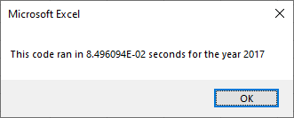

# VBA of Wall Street

## Overview

This is a review of stock market data for twelve tickers over two years. A VBA subroutine was written to analyze these tickers yearly for total volume and percent return. A similar subroutine was then refactored from a provided template to perform the same tasks more efficiently. Both subroutines included printing a timer, allowing for quantitative comparison of their runtimes.

## Results

The original subroutine was updated with the formatting block at the end of the refactored subroutine, to allow fair comparison of the two methods of iterating over the source data.

### Comparisons of the runtimes for each version of the subroutine, across both years

| Original | Refactored |
| -------- | ---------- |
|  |  |
|  |  |

Compared to the original, the refactored subroutine had 12.2% of the runtime for 2017 and 12.6% of the runtime for 2018.

## Summary

The original subroutine iterates over data set 12 times, while the refactored subroutine is able to accomplish the same goals over a single iteration. The code that needed to be refactored proved to have a more efficient solution to the project.